# **Zillow Time Series Modeling: Forecasting Future Real Estate Prices within Miami-Dade County**


Project Contributors: **Sanjit Varma, Anthony Conte and Harmandip Singh**


## Table of Contents
* [Overview](#overview)
* [Business Understanding](#business-understanding)
* [Data Understanding and Preparation](#data-understanding-and-preparation)
* [Model Training and Testing](#model-training-and-testing)
* [Recommendations and Conclusion](#Recommendations-and-Conclusion)
* [Contributors](#contributors)
* [Project Structure](#project-structure)


## Repository Links
* [Data](/data)
* [Python scripts](/tools)
* [Images](/images)


## Overview

In this project, we go through our process of creating a robust and accurate time series model model that is used to forecast average housing prices for various zipcodes within the Miami-Dade County region in Florida. We used data gathered from Zillow's website consisting information of the average home prices in each zip code starting from 1996 until 2018. Using a dataset consisting of over 14,000 unique zipcodes across the United States, we were able to identify a business problem that could be solved with the help of Machine Learning. We designed a workflow that enabled us to make accurate forecasts for a given zip code that was later used to iterate through multiple zip codes in order for us to gather conclusive and holistic insights into the future. This project demonstrates our ability to perform Data Analysis tasks using the Pandas library, create insightful visualizations with Matplotlib and Folium, and also our understanding of key machine learning and statistical concepts (particularly Time Series Forecasting) that were used to complete this project.


## Business Understanding

We framed our business problem by taking the role of an independent real estate consultancy. Our client is looking to purchase a home in the Miami-Dade county after recently accepting a job offer in the area. The client has established that they are not looking to spend over $300,000. They also specified that their current job offer is a 3 year contract and therefore there is a reasonable possibility that they may have to relocate after 3 years. Therefore, they have approached us to identify neighborhoods that have average prices under their budget which would also give them the highest return on investment if they were to sell their property upon relocation in 3 years. 

Our task is to identify the best 5 Zip Codes which we believe will have the highest ROI after 3 years of purchase. i.e. We want the zipcodes that we believe will appreciate the most in value after 3 years. These predictions will be made using Time Series modeling. 


## Data Understanding and Preparation

The data provided to us consists of information pertaining to over 14,000 Zip codes within the United States. The data is located within the ‘data/zillow_data.csv’ file in this repository. In total, there are 14,723 rows of data and 272 columns. Of these 272 columns, 7 of the columns are described below. The remaining 265 columns are records of the given Zip code’s average home value between April, 1996 and April, 2018. The other 7 columns are:


* ‘RegionID’- Each record contained a unique ID number. This column deemed unimportant for our analysis.
*’RegionName’-This is the column that provides the Zip code for the given row.
*’City’- The name of the city in which the Zip code is located.
*’State’- The name of the State in which the City is located.
*’Metro’-The name of the Metro region.
*’CountyName’-The name of the County
*’SizeRank’- The ranking of the particular Zip code’s size relative to other records in the dataset.


Our project goal was defined by our Business Problem where our client was only interested in purchasing a home within the Miami-Dade County. Therefore, the ‘CountyName’ column was particularly useful for us to filter our dataset and gain a detailed understanding of the selected County region.


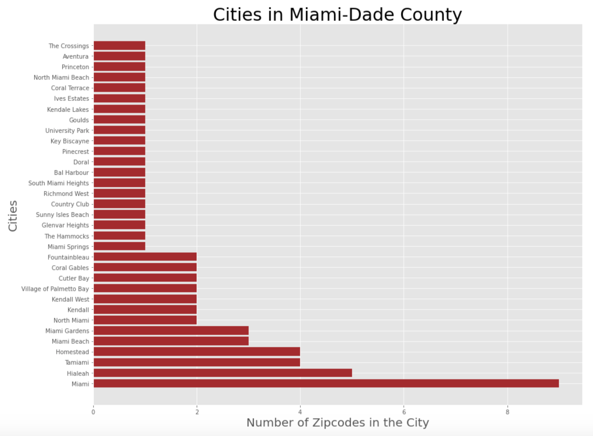


Having looked at the number of cities within the County region and understanding how each city is divided into Zip codes, we identified the various options that are available for people looking to find a new home in the area.

We were given clear instructions by the client that they have a budget of under $300,000 (USD) and they would prefer not to ‘that family’ living in the cheapest house in the neighborhood. Therefore, we filtered our dataset to include only Zip codes in the Miami-Dade County region which have average prices that are less than or equal to $300,00 during the anticipated purchase date of April, 2018 (the latest record of average home prices available in our dataset).


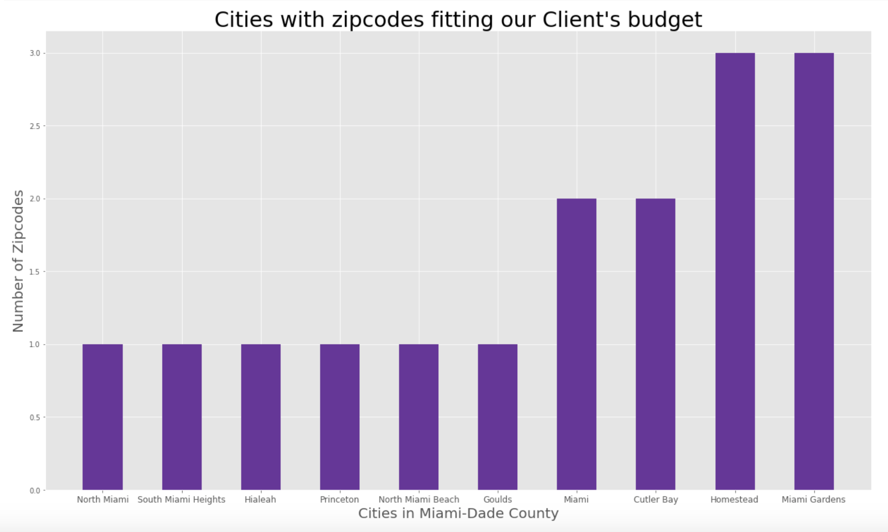


Having filtered our dataset to only include Zip codes with average prices under our client’s budget, we were left with the cities displayed above. The 10 different cities seen here consisted of 16 unique Zip codes between them. ‘Miami Gardens’ and ‘Homestead’ each still had 3 Zip codes within them that could fit our client’s budget.

Having recognized our available options, we looked at the time series data of our 16 Zip codes to get an overview of how their average prices have changed in the last 22 years. 


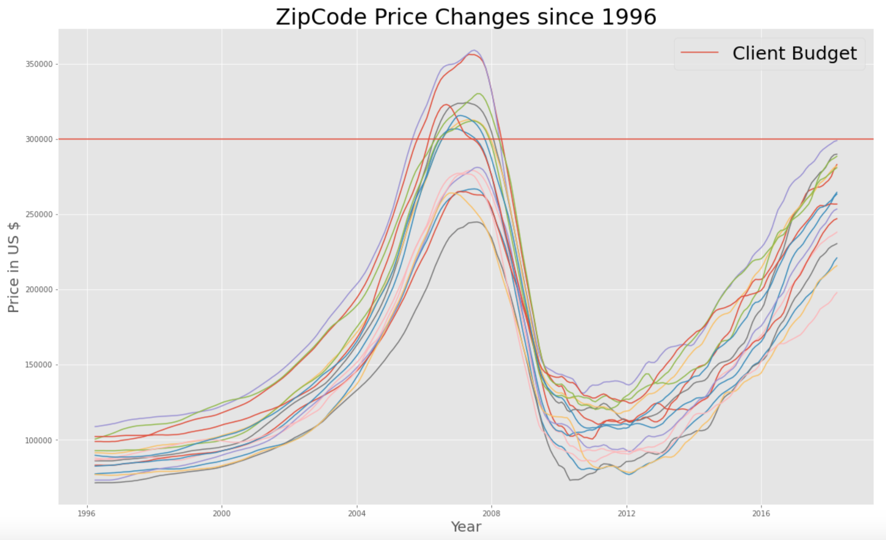


From the chart above we could infer that prices seemed to have peaked before the 2008 recession, only to see a dramatic fall immediately after. Since then, prices have been steadily on the rise since 2011 but have yet to reach their pre-recession peaks. Hence, this came across as a promising investment opportunity with plenty of likely upside.


Having seen that prices have started to pick up after the recession, we wanted to see more clearly which Zip code areas have been growing the fastest since 2011 (the point where the growth seemed to begin). Below we can look at a graph that shows us the Zip codes by order of highest growth. 


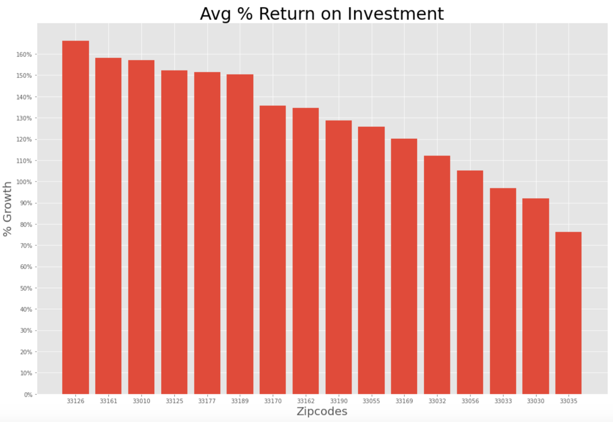


We can see from the above visual that the highest growing zip code since 2011 is 33126.

Since we want to build a Time Series model to predict the future ROI for each zip code in Miami-Dade County within our client's budget; we selected one specific Zip code to build our time series model on. For this purpose, we chose to use the highest growing Zip code since 2011 and hence, we ran our first Time Series model on the Zip code- 33126 to predict what its future value will be. Our approach was to later implement a similar workflow on other Zip codes in the County to identify which 5 Zip codes have the highest predicted ROI.


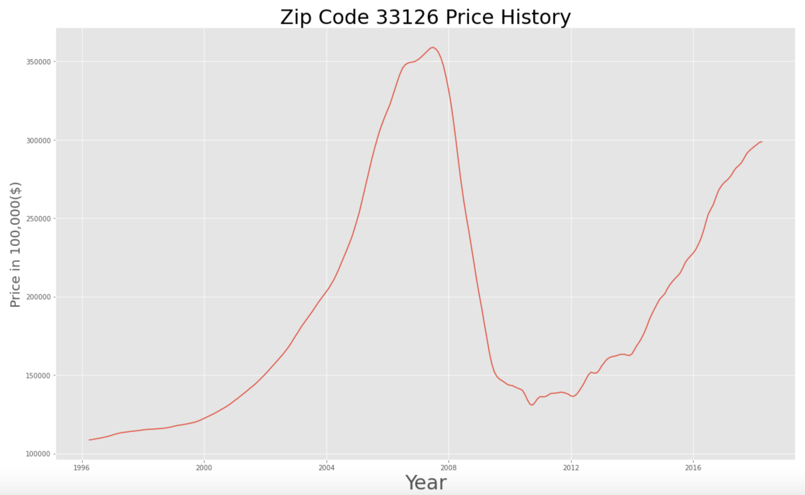


The trend we see above is not greatly dissimilar to all the other zip codes we saw earlier during our earlier data exploration. However, we find that market conditions before the 2010s do not necessarily reflect the state of today's market. Therefore, we chose to concentrate on modeling our Time Series only based on information from 2011.


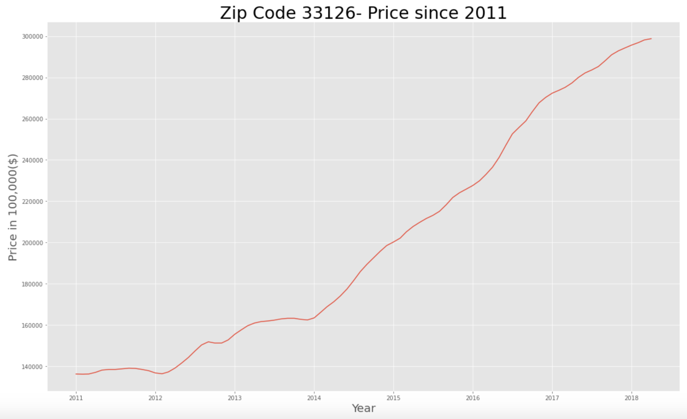


Now we could see a positive trend that displayed a somewhat linear growth rate in average price.


## Model Training and Testing

Before feeding our data into the model, we split our time series data for the Zip code 33126 into a train and test set. The Training Data consisted of the region’s monthly pricing history from April, 1996 to April, 2016. And the Test Data consisted of the remaining information being the monthly price history for the region from May, 2016 to April, 2018.

Given that our model of choice was the SARIMAX model (Seasonal Auto Regressive Integrated Moving Average with Exogenous Factors), we were able to directly feed in our raw series. This is because the SARIMAX model automatically does the differencing in our series for us to eliminate any trends or seasonality. i.e. Making our data stationary (an important step to prepare the data for modeling).

The following images are the model diagnostics printed after fitting the data series. This helped us get an indication of whether further tweaking would be necessary.

We want to make sure that our residuals are not correlated and also have a normal distribution. So, we checked for these assumptions from the following diagnostics plots.


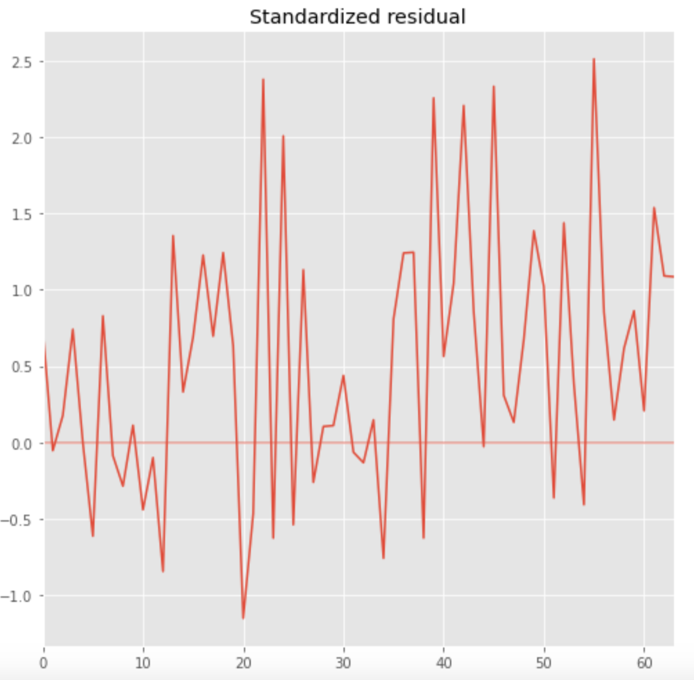


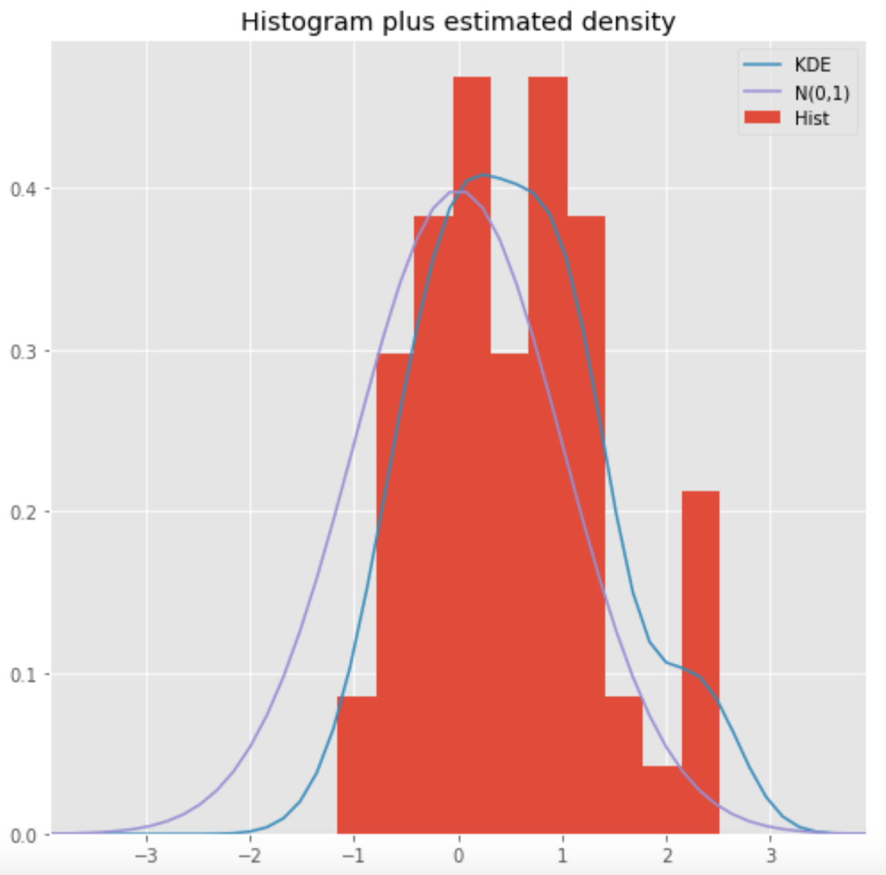


In the histogram, our KDE line somewhat closely follows along the N(0,1) line which is the standard notation for a normal distribution having a mean of 0 and standard deviation of 1. This tells us that the residuals are normally distributed.


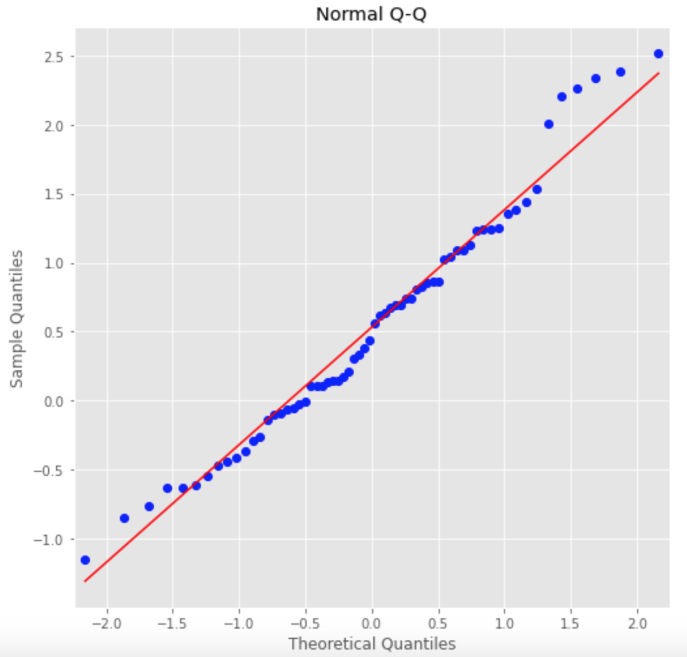


Our qq-plot displays that our residuals are following the linear trend line. This tells us that the residuals seen here are normally distributed.

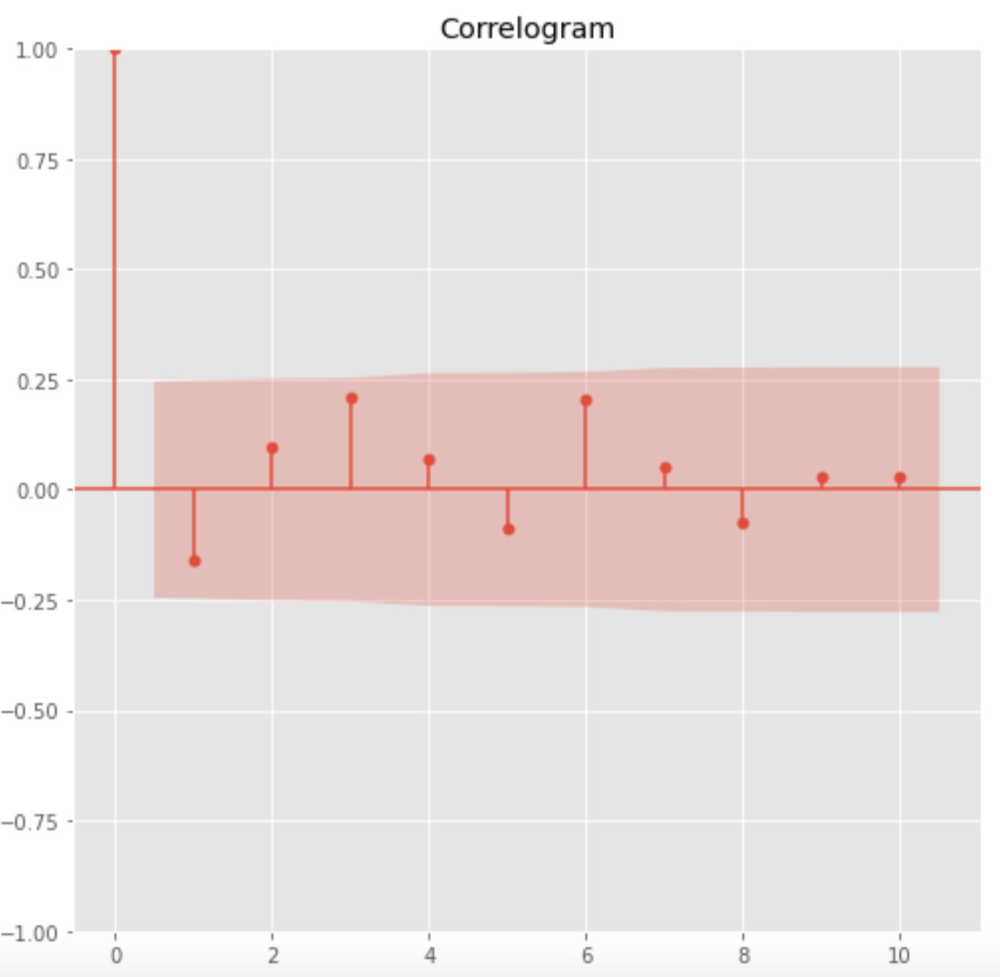

From the Correlogram plot on the bottom left, we see that the time series residuals diaplay low correlations with their lagged versions. This is clearer as we move further along the time series. This tells us there isn't obvious seasonality in our series.


Based on these observations, we can be confident that the model does not have correlations and that it satisfactorily fit our data to forecast future prices.


Having fit our training data, we then received predictions for the period between May, 2016 and April 2018; the same period that was used for our test data. We plotted these predictions on the same chart to see how far/close they were from each other.


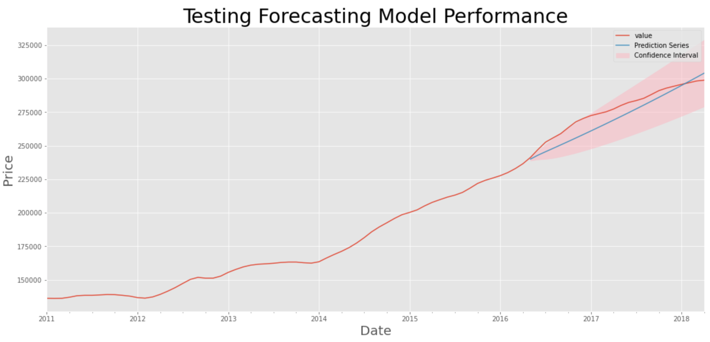


Our model was not perfectly accurate but it was able to capture the overall trend that truly occurred between April, 2016 and April, 2018. 


## Recommendations and Conclusion

Now that we had a model that could perform well over a 2-3 year period, we could move on to forecast the future until April, 2021- the point at which we would have reached 3 years from the purchase date of April, 2018.


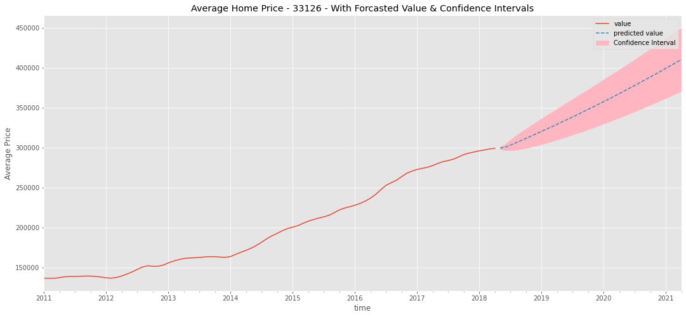


Having established a workflow for forecasting future prices for one Zip code, we could plug in this entire process into a loop to attain our expected prices in April, 2021 for the remaining Zip codes in Miami-Dade County that have average prices under our clients' budget.


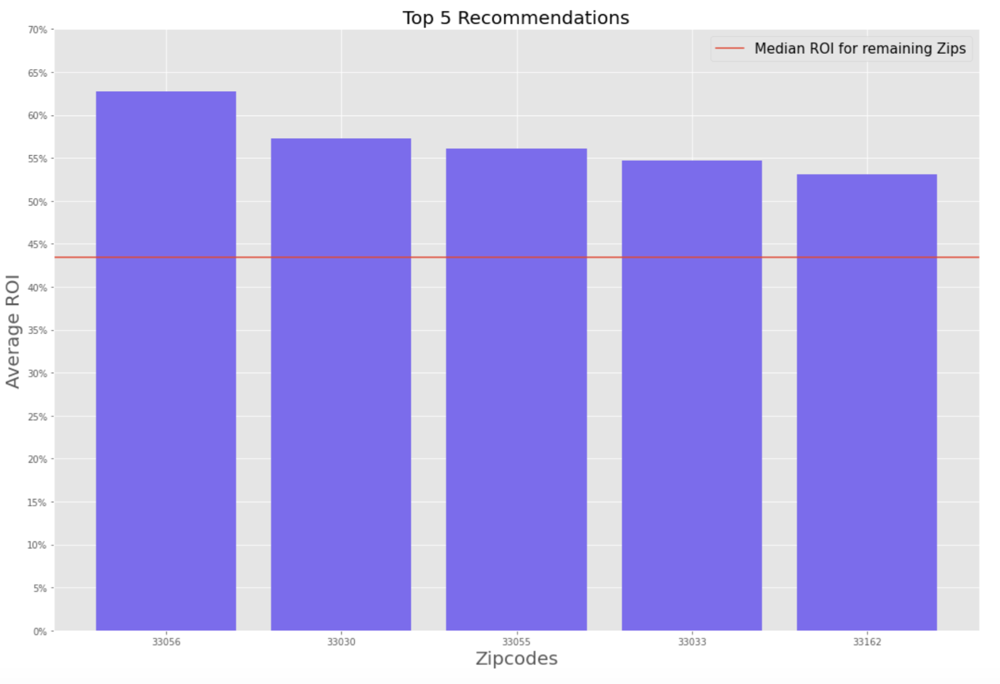


We could see from above that our model predicts the zip-code region of 33056 to see the highest growth. But the other 4 of the top 5 Zip codes also have a forecasted ROI with encouraging returns. We can also see that our top 5 recommended Zip codes are well above the median 3 year return of the remaining zip codes. 


Based on our work above, we can finally conclude our top 5 recommendations and their expected ROI after 3 years: - 


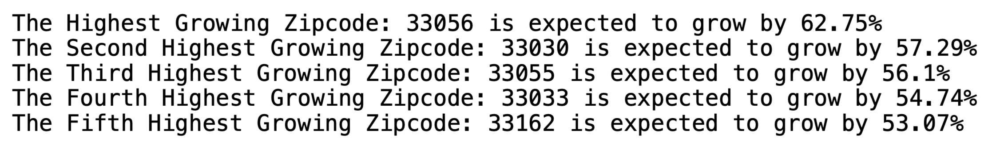


Below is a visualization of where our recommended regions are located:


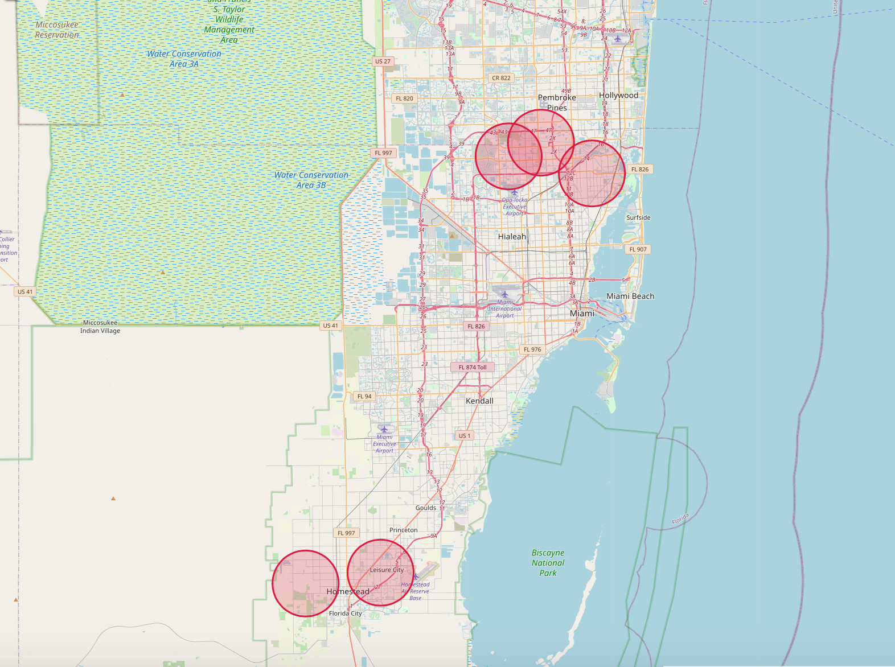


## Contributors
- Harmandip Singh <br>
    Github: hs1692<br>
- Sanjit Varma <br>
    Github: sanjitva<br>
- Anthony Conte <br>
    Github: antconte92<br>


## Project Structure
```
├── final_notebook.ipynb
├── README.md
├── data
├── images
└── tools
    ├── __init__.py
    └── helpers.py
```

